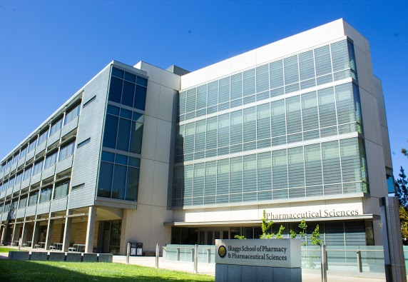

# Dorrestein Lab Website

### Research Aims

1. Develop new mass spectrometry tools including bioinformatics tools

2. Understand Chemistry within microbes and how it impacts the ecosystem

3. Develop mass spectrometry approaches to visualize metabolic exchange in a spatial and system-wide manner

4. Develop mass spectrometry approaches to structurally characterize molecules involved in metabolic exchange and monitor their dynamics

5. Find innovative ways of community engagement in data analysis